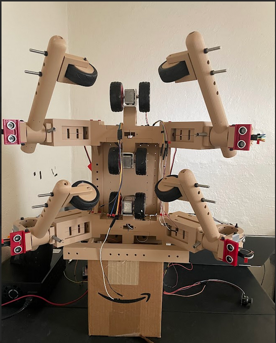

# Pole-Climbing Robot

## Overview
Designed and developed a wheel-based dual-arm robotic system capable of vertical pole climbing and obstacle navigation for industrial inspection and worker safety applications.

---

## Problem Statement
Pole-climbing robots (PCR) are used for inspection, maintenance, monitoring of vertical infrastructure, such as poles, towers, etc. Howevever reliability and obstacle negotiation remain the significant challenges among existing robots in this field. In fact, based on my research on existing PCRs, I identified several unresolved issues as listed below.
+ reliable obstacle negotiaton without complete loss of grip
+ continuous stability during climbing transitions
+ adaptability to varying pole diameters
+ reduced mechanical and control complexity while maintaining robustness
 
Motivated by these gaps, I attempted to design and develope a modular dual-arm PCR equipped with motorized wheels and a coordinated arm reconfiguration strategy. The proposed system ensures continuous gripping by alternately engaging the upper and lower arms during obstacle traversal, thereby maintaining stability throughout the climbing process while nevigating around obstacles. 
---

## System Architecture

<!---->

- Dual motorized gripping arms
- Wheel-based climbing mechanism
- Sequential arm coordination for obstacle navigation
- Microcontroller-based control logic
- Sensor-based obstacle detection

---

## Control Strategy
- Finite State Machine (FSM) for arm coordination
- Upper-arm release while lower-arm maintains load during obstacle crossing
- Sensor-triggered state transitions
- Synchronized motor control for stable vertical climbing

---

## Technologies Used
- Embedded C / Microcontroller Programming
- DC Motor Drivers
- Electromechanical Design
- Control Systems
- Mechanical CAD

---

## Current Status
Prototype development and system architecture validation in progress.

### Upper Stage Under Test
 

---

## Future Improvements
- Closed-loop torque control
- IMU-based stabilization
- Vision-based obstacle detection
- Load analysis and stress optimization
